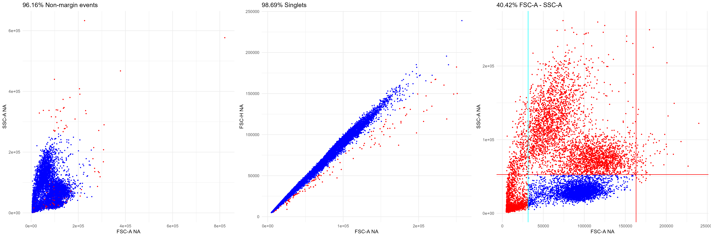

# CytoBright
Estimate Stain Index for single stained cytometry files.

## Installing the package

To install the latest version of the package, run the following R commands

```
install.packages("devtools")
devtools::install_github("Saeyslab/CytoBright")
```

## Computing Brightness on Single Stains

### Defining the files of interest and metadata

For the example, we load some data that is stored inside the CytoBright package.
You should adapt this directory to point to your directory of interest.
While the metadata table can also be a dataframe created in R, it is often
easiest to store this information in an excel file.

Important values in the excel file:
Fluorochrome | Detector | File
----|----|----
BUV395 | UV379-A | UV laser_BUV395.fcs
BV421 | V431-A | V laser_BV421.fcs
FITC | B530-A |B laser_FITC.fcs
PE | YG586-A | YG laser_PE.fcs
AF700 | R730-A | R laser_AF700.fcs

```{r}
fcs_dir <- system.file("extdata/example_data/with_unstained", 
                       package = "CytoBright")
meta <- readxl::read_xlsx(file.path(fcs_dir, 
                                    "220309-FlowCore-SymphonyA3-CD4.xlsx"))
meta <- as.data.frame(meta, check.names = FALSE)
```

Update the meta dataframe to contain consistent fluorochrome names,
full file paths and unique IDs. As in this case every fluorochrome occurs only
once, we can use the flurochrome name as the ID.
```{r}
meta$Fluorochrome <- clean_fluorochromes(meta$Fluorochrome)
meta$File <- file.path(fcs_dir, meta$File) # Add directory
meta$ID <- rownames(meta) <- meta$Fluorochrome
```

Our package also contains a table of some theoretical brightness values, as 
derived from different company websites.
```{r}
expected_brightness <- theoretical_brightness()
meta$BrightnessLevel <- expected_brightness[meta$Fluorochrome, "Brightness"]
```

### Defining pregating steps

We will also apply some pregating to only work on events of interest.
This gating information is stored in a list structure. The marker_values 
argument corresponds to the arguments for the estimate_gate function, where 
flowDensity::deGate is used to try to find a possible cutoff in the range of 
e.g. the minimal value plus or minus the range_min. If no value is found in 
that range, the passed minimal value will be taken instead. 
```{r}
gating_info <- list(list(marker_values = list(`FSC-A` = c(min = 60000, 
                                                          range_min = 50000, 
                                                          max = 125000, 
                                                          range_max = 50000), 
                                              `SSC-A` = c(max = 80000,
                                                          range_max = 50000))))
```

### Stain index calculation

In combination with the pregating, the package also supports several additional
preprocessing steps, such as removal of margins or doublets with the PeacoQC
package.
If pregating is performed on some fluorescent channels, a transformList might
need to be passed along as well.
Once we have all this information, we can estimate the brightness. In this
example, we use an unstained file to estimate the negative population. If the
unstained parameter is set to NULL, the negative population is taken from the
single stain file itself.

```{r}
brightness <- estimate_brightness(meta,
                                  preprocessing_parameters = list(compensate = FALSE, 
                                                                  removeMargins = TRUE,
                                                                  removeDoublets = TRUE, 
                                                                  pregate = gating_info, 
                                                                  pregate_tf = FALSE),
                                  return_cells = TRUE,
                                  seed = 1,
                                  comp = NULL,
                                  unstained = file.path(fcs_dir, "Specimen_001_US.fcs"))
```

### Storing the results

`brightness$SI` will contain all information from the original metadata,
as well as added columns for the `Cutoff` value determined, the `MFI`s of the 
positive and negative populations, the range of the negative population 
(0.05 and 0.95 quantiles are used), the robust Standard Deviation calculated as
(max_neg - min_neg) / 3.29, and the estimated Stain Index (`SI`).

This information can easily be stored in an excel file.
```{r}
writexl::write_xlsx(brightness$SI,
                    "brightness_220309_SymphonyA3.xlsx")
```

Additionally, all preprocessing figures are stored as well as some values of 
individual cells for visualisation purposes. They can for example be stored
with the following command

```{r}
ggplot2::ggsave("preprocessing_BUV395.png",
                ggpubr::ggarrange(plotlist = brightness$pregating_plots$BUV395,
                                  nrow = 1),
                width = 21, height = 7)
```


With the `plot_brightness` function an overview of the brightness of the
different fluorochromes can be generated.

```{r}
ggplot2::ggsave("brightness_overview.png",
                plot_brightness(brightness$SI, brightness$cells),
                width = 10, height = 5)
```

